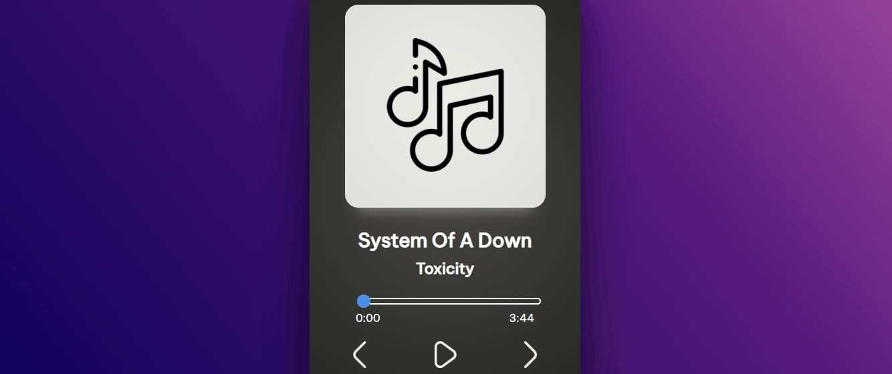

# 🎶 Player De Musica

---

    <a href="#📖 Sobre">Sobre</a> •
    <a href="#💻 Tecnologias">Tecnologias</a> •
    <a href="#📷 Preview">Preview</a>

**
🚧Em construção🚧
**

---

## Sobre

**Olá, Hoje estou um projeto com umas features bastante interessante para treinar o JS, um player de musicas, nesse projeto utilizei coisas basicas do JS. arrays, functions e objetos**

---

## Tecnologias

    
    
    

---

## Preview

    

---
**Made with 💜 by DevErickBR [See my LinkedIn](https://www.linkedin.com/in/erick-yan-carvalho-b2aa5b226/)**
